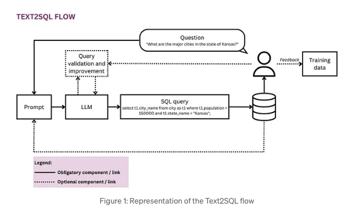

# Text-to-SQL Execution
Enterprise data is often stored in SQL databases. LLMs make it possible to interact with SQL databases using natural language. We can essentially build SQL `Chains` and Agents to build and run SQL queries based on natural language prompts. These are compatible with any SQL dialect supported by SQLAlchemy (e.g., MySQL, PostgreSQL, Oracle SQL, Databricks, SQLite).


## Target Use Cases

- Generating queries that will be run based on natural language questions
- Building custom dashboards based on insights a user wants to analyze
- Creating chatbots that can answer questions based on database data
- Generating complex queries based on natural language
- Expanding database access to non-technical people and stakeholders

## Benefits
- Business users can access organisational data in a direct and timely way.
- This relieves data scientists and analysts from the burden of ad-hoc requests from business users and allows them to focus on advanced data challenges.
- The business can leverage its data in a more fluid and strategic way, finally turning it into a solid basis for decision making.

## Workflow
- Build SQL queries based on natural language user questions
- Query a SQL database using chains for query creation and execution
- Interact with a SQL database using agents for robust and flexible querying



## Example

Let's suppose you have a SQL Database hosted on RDS. It stores `expense` transaction information for your users. If you were to retrieve the total spend for a specific user, you'd need to write a SQL query similar to this one: 

```
SELECT SUM(amount) from Expenses WHERE UserId = 1.
```

But instead using LLMs you can run a chain that takes in natural language and then creates the SQL for you. So to create that same query you'll instead use: `What's the total spend for user 1?`


## How to run

1. Setup environment and environment-variables.
   ```sh
   conda env create -f environment.yml
   conda activate text-to-SQL
   cp .env.example .env
   ```
   Populate `OPENAI_API_KEY`

2. Run the app
   ```sh
   chainlit run main.py
   ```
   With hot-reload

   ```sh
   chainlit run main.py -w
   ```